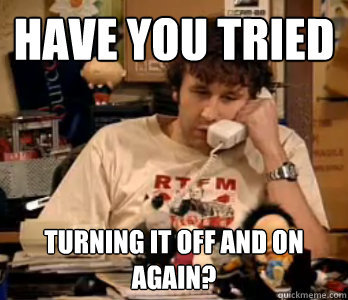
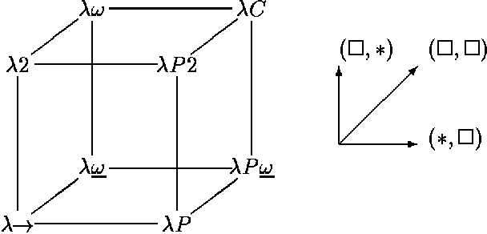

#HSLIDE

## The Rise Of The Functions


#HSLIDE
### Who am I?

* I'm Nikolay/Meddle |
* I program servers and infrastructure |
* I work for InflowMatix, so I work with water |
* I'm part of elixir-lang.bg |
* And many other things... |

#HSLIDE


#HSLIDE


#HSLIDE
### Who are you?

* People who care about functional programming? |
* Or people who want to care about functional programming? |
* Or you like JavaScript and think it is functional? |

#HSLIDE


#HSLIDE
### Let's start with the past


#HSLIDE
### In the past...
* When I first started working, there were two choices, if you were doing 'web'... |
* ...Java and PHP... |
* So Java happened to me and I'm actually happy! |
* Because the alternative... |

#HSLIDE
### PHP


#HSLIDE
### In the past...
* But why?
* This was 2004-2005? What was the state of the programming world then? |
* Actually even before that time, in the 90s, the trends were simple and quite different |

#HSLIDE
### In the past...


#HSLIDE
### In the past...
* Philip Wadler wrote a paper back in 1998, titled: |
* "Why no one uses functional languages" |
* In this paper he mentioned that they are actually used in some niche fields |
* Like Erlang, for example for telecommunication and CAML, HOL for theorem proving |


#HSLIDE


#HSLIDE
### Nobody uses it!

* Functional programming can be traced back to lambda calculus, it is closer to Math |
* The functional languages didn't have the rich set of libraries, C/C++/Java had  |
* They were not portable, it was hard to communicate with the underlying architecture |

#HSLIDE
### Nobody uses it!
* They had bad tooling. Everything had bad tooling at the time, but niche and academic languages were the worst...
* Lack of training. Universities were not training you to be lazy! |
* No popularity - C++/Java/VB, they were all popular for the different companies, not Haskell! |

#HSLIDE
### Unpopular


#HSLIDE
### Nobody uses it!

* It is interesting that the performance was never the issue |
* Just life was simpler, no real parallelism except in some niche businesses |
* Small amount of clients/users |
* Why use alternatives if everything is perfect |

#HSLIDE
### Perfect


#HSLIDE
### Changes

* But nothing is perfect... |
* And our minds don't work the same... |
* And there is no silver bullet... |
* For some jobs you can have many alternative tools, for some not... |

#HSLIDE
### The right tools


#HSLIDE
## Tools And Platforms
### The Web And JavaScript


#HSLIDE
### JavaScript


#HSLIDE
### JavaScript
* Netscape’s Mocha was the language of the browser
* It had to be simple, with almost no verbose syntax, easy to be used by even non-developers |
* So why not make it simple like Scheme, a dynamic, powerful, and functional in nature? |
* And here we have a use of functional language, because they come with simplicity (and to think that people think of them as complex) |

#HSLIDE
### JavaScript
* Enter Brendan Eich the father of JavaScript
* He wanted Mocha to be something like Scheme for the browser |
* Also, did you know that Netscape wanted it on the server too - see LiveWire |

#HSLIDE
* Because of pressure, what was meant to be a Scheme for the browser turned into something very different
* It had to have big friends, as it was against a big enemy - Microsoft |
* So it became the companion language of Java and was renamed to JavaScript |

#HSLIDE
### JavaScript
* A Java-like syntax was required, and familiar semantics for many common idioms were also adopted.
* So Mocha looked like Java, but underneath was some crossbreed between Scheme and Self |
* It had functions as first class citizens! |
* Events and callbacks! |

#HSLIDE
### JavaScript and the changes


#HSLIDE
### JavaScript
* At first JavaScript was not very usable, it was no good for a live web, we had applets and then Flex/Flash for that...
* But with time, computers and browsers became more powerful! |
* And now we can draw stuff with JavaScript, we can do real applications in a single web page! |

#HSLIDE


#HSLIDE
### JavaScript
* The reactor pattern, event dispatching, all of this can be handled with chains of functions!
* The first class citizens are now first class rulers! |
* Reactive programming is a thing (was a buzz word), also : async/await! |
* Arrows and immutable structures! |

#HSLIDE


#HSLIDE
### JavaScript
* So everybody knows some JS and JS has some functional stuff in it...
* So everybody knows how to map and chain functions and that event driven can be cool? |
* Not really, but it is not so niche now. |
* Also it has alternative objects to the C++/Java-like |
* And we have so many things in it! |

#HSLIDE


#HSLIDE
```javascript
let Y = (h) => {
  return ((f) => f(f))(
    (g) => h((x) => g(g)(x))
  );
};
```

#HSLIDE
## Tools And Platforms
### The Reactive Big Data Blockchain Buzz

#HSLIDE


#HSLIDE
### The reactive idea

* So when we have a desktop application, we react to events to refresh the state for the user |
* That's cool, that worked for JavaScript |
* But every program is written around its data... |
* So when the data changes, it'll be cool if the program reacts |

#HSLIDE
### The reactive idea


#HSLIDE
### The reactive idea
* Of course Haskell is the beginning |
* And Erik Meijer's ideas influenced C#'s reactive extensions |
* Then we had all the open RX libraries like RXJava and RXJS |
* That and handling more and more data made changes possible |
* To not write boilerplate, languages were getting simplified |

#HSLIDE
### The reactive idea
* Everything is represented with something like a stream
* A very functional data structure... |
* Data is streamed, errors are streamed, lazily pushed |
* Data can be transformed as it is incoming |
* How? With map/reduce/filter, of course! |

#HSLIDE

```html
<div class='counter'>0</div>
<button onclick='P.registry.s("plus").trigger(1)'>+</button>
<button onclick='P.registry.s("minus").trigger(1)'>-</button>
```

```javascript
ProAct.registry.make('s:plus')
ProAct.registry.make('s:minus', 'map(-)')
ProAct.registry.make(
  's:main',
  '<<(s:plus, s:minus)|acc(+)|@($1)',
  (v) => {
    let counterEl = document.getElementsByClassName('counter')[0]
    counterEl.innerHTML = v
  }
)
```

#HSLIDE
```java
input.map(new Func1<String, Matcher>() {
			public Matcher call(String str) {
				return pattern.matcher(str);
			}
		}).filter(new Func1<Matcher, Boolean>() {
			public Boolean call(Matcher matcher) {
				return matcher.matches() &&
          matcher.group(1) != null;
			}
		}).map(new Func1<Matcher, String>() {
			public String call(Matcher matcher) {
				return matcher.group(1);
			}
})
```

#HSLIDE
```java
input
.map(pattern::matcher)
.filter(matcher -> matcher.matches() && matcher.group(1) != null)
.map(matcher -> matcher.group(1))
```

#HSLIDE
### Functional Java
* Underneath are the same old anonymous class implementations
* But for stuff like that Java is now functional |
* I've written some functional-like code with Java back in 2008-2009 |
* We had immutable data model implementations |
* Why? Because we did desktop GUI and collaboration! |

#HSLIDE


#HSLIDE
### Functional OO
* C++ is getting functional and has inference
* The JVM has its share of functional languages like Scala |
* We are getting more and more like Elm and F# |
* Why? Because it makes life simpler with so much data and so many users |
* Also, parallelism... |

#HSLIDE


#HSLIDE
## Tools And Platforms
### Parallel computing


#HSLIDE
### The shared state
Joe Armstong:

```
I'm an ex physicist.
In classical physics and ignoring quantum effects,
two objects in the real world cannot exist
in the same place at the same time.
```

#HSLIDE
### The shared state
* Imperative languages like sharing state, and global state
* That's OK in a non-concurrent world |
* That can be OK in a non-parallel world, but to some extend, lock, lock and lock again |
* Functional programming is immutable, all is data, even the actions |

#HSLIDE
### The shared state
* In the past only the niche telecom software required real parallelism
* But now almost everything requires it |
* Computers don't get more powerful CPUs, they get more CPUs |
* Collaboration, real time communication, millions of users in the same time |

#HSLIDE
### The shared state
* So languages like Erlang and Elixir are getting more and more popular
* Non-shared state models of parallelism are getting popular |
* No shared state? We can let it crash! |

#HSLIDE


#HSLIDE
## Tools And Platforms
### Reliable compilers, types and simplicity

#HSLIDE


#HSLIDE
* If it compiles, it will most definitely run
* Yup, type systems are cool |
* Powerful type system come from the Math "Type Theory". |
* And Math is our friend! |

#HSLIDE


#HSLIDE
* Better inference
* Reliable type checking |
* Algebraic data types |
* Types and programming languages... |


#HSLIDE


#HSLIDE
* And that's why we get modern languages, inspired by functional concepts like Rust
* Or F# and Scala
* Or old powerful languages like Haskell and OCaml resurface

#HSLIDE
* Define structures using type algebra and type constructors?

```haskell
data Tree a = Leaf a | Node (Tree a) (Tree a)
```

```ocaml
type 'a llist = Nil | Cons of ('a * 'a llist)
```

#HSLIDE
* Where do you think generics come from?

```rust
pub enum Option<T> {
    None,
    Some(T),
}
```

```rust
let x: Option<u32> = Some(2);
```

#HSLIDE
## Alternatives


#HSLIDE
### Alternatives
* I'm not saying that the functional way is the only way |
* We are different, we deal with problems differently |
* The important thing is, that now there are alternatives in the way we write code |

#HSLIDE


#HSLIDE
### Alternatives
* I do some time go full functional, why not?! |
* Chose your path, chose your destiny, chose your efficiency! |
* We are not robots, we can chose the businesses we like to contribute to! |

#HSLIDE


#HSLIDE
### Try new things
* Now, the functions are on the rise, but not only! |
* So why not read about or try new things? |

#HSLIDE
### Try new things!


#HSLIDE
## The End

* https://twitter.com/ntzvetinov
* https://themeddle.com


